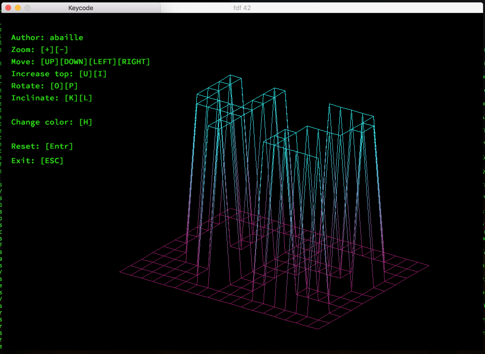
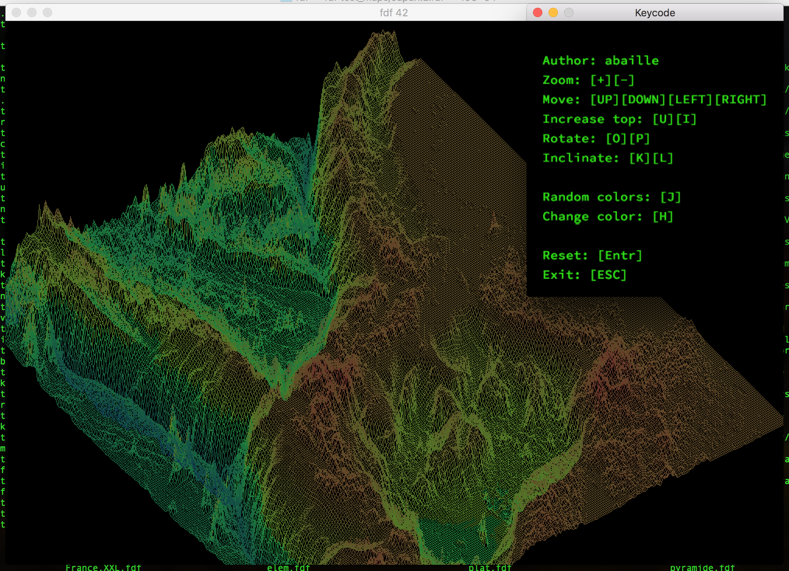
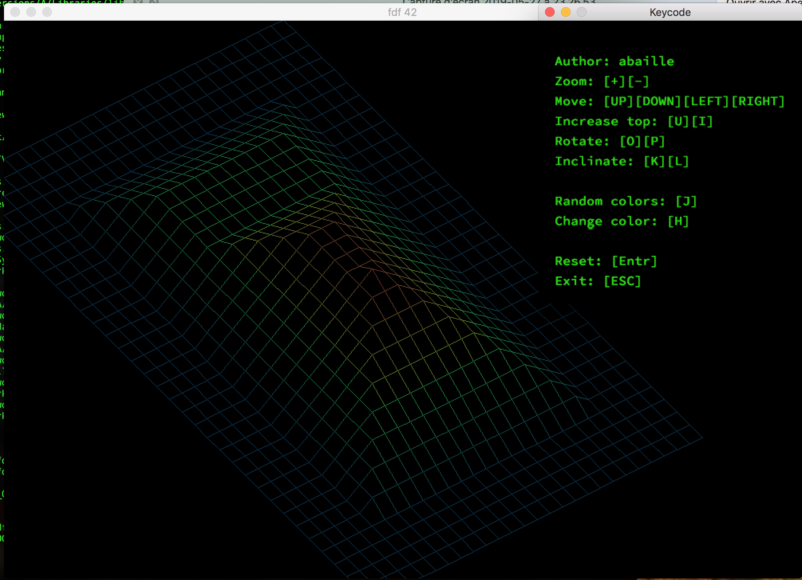

# FdF
3D Wireframe Viewer - 42 Graphic branch project



# Built & Features

C, MLX library
* Rotation
* Inclinaison
* Colors depending of altitude
* Zoom
* Move
* Increase altitude



# Use

```
make && ./fdf test_maps/[map].fdf
```

